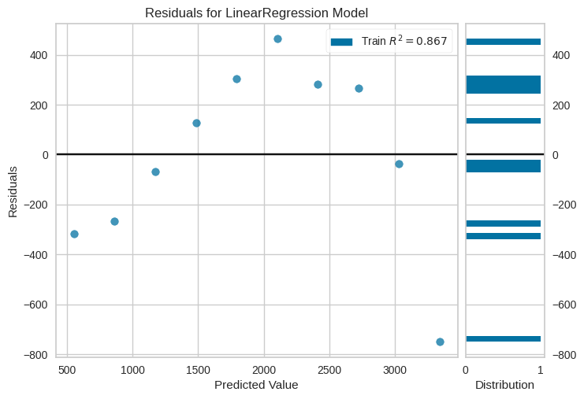

# Classe "ResidualsPlot"

A classe `ResidualsPlot` do módulo `yellowbrick.regressor` é uma ferramenta útil para visualizar e avaliar os resíduos (erros) de um modelo de regressão. Os resíduos são a diferença entre os valores reais (observados) e as previsões feitas pelo modelo. A análise dos resíduos é importante para verificar se o modelo de regressão está capturando adequadamente a estrutura dos dados.

## Sintaxe

```python
from yellowbrick.regressor import ResidualsPlot

visualizer = ResidualsPlot(model)
```

### Principais métodos

- **`fit(X, y)`**: Este método é usado para ajustar o gráfico de resíduos ao modelo de regressão e aos dados de treinamento.

  - `X` são as variáveis independentes (características) dos dados de treinamento.
  - `y` é a variável dependente (alvo) correspondente aos dados de treinamento.

- **`poof()`**: Este método gera um gráfico de resíduos que mostra os resíduos em relação às previsões do modelo. Ele também inclui uma linha de referência no valor zero, que indica onde os resíduos deveriam estar idealmente se o modelo fosse perfeito. O gráfico de resíduos pode ajudar a identificar tendências ou padrões nos resíduos, como heterocedasticidade (variância não constante) ou não linearidade.

## Exemplo

```python
from yellowbrick.regressor import ResidualsPlot
from sklearn.linear_model import LinearRegression
import numpy as np

# Carregando os dados
base_health_insurance = pd.read_csv("../../assets/plano_saude.csv")
X_health_insurance = base_health_insurance.iloc[:, 0].values.reshape(-1, 1)
y_health_insurance = base_health_insurance.iloc[:, 1].values

# Criando um modelo de regressão linear
regressor_health_insurance = LinearRegression()

# Ajustando o modelo aos dados de treinamento
regressor_health_insurance.fit(X_health_insurance, y_health_insurance)

# Criando o gráfico de resíduos
visualizer = ResidualsPlot(regressor_health_insurance)

# Ajustando o gráfico aos dados de treinamento
visualizer.fit(X_health_insurance, y_health_insurance)

# Exibindo o gráfico
visualizer.poof()
```



Neste exemplo, estamos criando um modelo de regressão linear, ajustando-o aos dados de treinamento e, em seguida, usando a classe `ResidualsPlot` para criar e exibir o gráfico de resíduos. O gráfico de resíduos ajudará na avaliação da qualidade do ajuste do modelo e na identificação de quaisquer padrões nos resíduos que podem indicar problemas no modelo. Isso é útil para diagnosticar problemas como heterocedasticidade, não linearidade ou outliers nos dados.