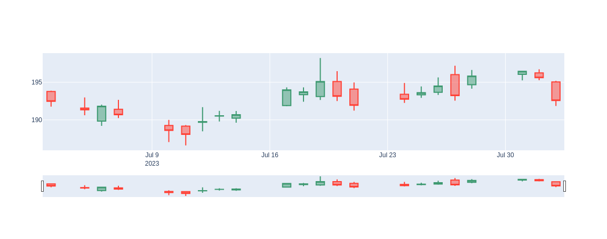
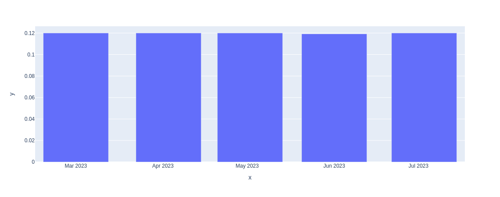

# Função "history"

A função `history` da biblioteca yFinance é usada para obter o **histórico de preços** e **informações financeiras** (dividendos e desdobramentos) de um ativo financeiro (como ações, índices, moedas, etc.) a partir do Yahoo Finance.

## **Sintaxe**

```python
def history(
  self,
  period: str = "1mo",
  interval: str = "1d",
  start: Any = None,
  end: Any = None,
  prepost: bool = False,
  actions: bool = True,
  auto_adjust: bool = True,
  back_adjust: bool = False,
  repair: bool = False,
  keepna: bool = False,
  proxy: Any = None,
  rounding: bool = False,
  timeout: int = 10,
  debug: Any = None,
  raise_errors: bool = False
) -> DataFrame
```

**Parâmetros:**

- `period`: Define o período de tempo para o qual deseja-se obter os dados históricos. Pode ser especificado de diferentes maneiras, por exemplo, "1d" para um dia, "1mo" para um mês, "3mo" para três meses, "1y" para um ano, etc.

- `interval`: Especifica o intervalo de tempo entre os dados. Por exemplo, "1d" para dados diários, "1h" para dados de uma hora, "5m" para dados a cada 5 minutos, etc.

- `start` e `end`: Podem ser usados para especificar uma data de início e fim personalizada para os dados históricos.

- `prepost`: Se for `True`, incluirá dados de pré-mercado e pós-mercado (se disponíveis).

- `actions`: Se for `True`, incluirá informações sobre eventos corporativos, como dividendos e splits.

- `auto_adjust`: Se for `True`, os preços de fechamento ajustados serão retornados.

- `back_adjust`: Se for `True`, ajustará os preços para trás.

- `repair`: Se for `True`, tentará reparar dados ausentes.

- `keepna`: Se for `True`, manterá valores ausentes na série de tempo.

- `proxy`: Define um proxy para conexão.

- `rounding`: Se for `True`, os valores serão arredondados para 2 casas decimais.

- `timeout`: Define o tempo limite para a solicitação dos dados.

- `debug`: Define a saída de depuração para a solicitação.

- `raise_errors`: Se for `True`, irá lançar exceções se houver problemas ao obter os dados.

**Retorno:**

A função retorna um objeto DataFrame do pandas que contém os dados históricos do ativo financeiro solicitado. O DataFrame terá colunas como "Open", "High", "Low", "Close", "Volume", entre outras, que representam os preços e informações financeiras para cada intervalo de tempo solicitado.

## **Exemplos**

### **Histórico de preços**

```python
import yfinance as yf

# Obter o histórico de preços diário do FII Maxi Renda (MXRF11) nos últimos 6 meses
mxrf11 = yf.Ticker("MXRF11.SA")
history_df = mxrf11.history(period="6mo", interval="1d")

print(history_df)
```

**Saída:**

| Date                      |    Open |    High |     Low |   Close | Volume | Dividends | Stock Splits |
| :------------------------ | ------: | ------: | ------: | ------: | -----: | --------: | -----------: |
| 2014-08-06 00:00:00-03:00 | 6.91544 | 6.92301 | 6.81539 | 6.87088 |  96180 |         0 |            0 |
| 2014-08-07 00:00:00-03:00 | 6.85826 | 6.85826 | 6.73551 | 6.85238 |  88680 |         0 |            0 |
| 2014-08-08 00:00:00-03:00 | 6.79773 | 6.93225 |  6.7683 | 6.89442 |  64400 |         0 |            0 |
| 2014-08-11 00:00:00-03:00 | 6.89442 | 6.89442 | 6.81202 | 6.84397 |  52250 |         0 |            0 |
| 2014-08-12 00:00:00-03:00 | 6.85238 | 6.89442 | 6.77419 | 6.81118 |  49290 |         0 |            0 |
| ...                       |     ... |     ... |     ... |     ... |    ... |       ... |          ... |
| 2023-07-27 00:00:00-03:00 |   10.53 |    10.6 |   10.51 |   10.59 | 646323 |         0 |            0 |
| 2023-07-28 00:00:00-03:00 |   10.59 |   10.64 |   10.58 |   10.61 | 688091 |         0 |            0 |
| 2023-07-31 00:00:00-03:00 |   10.62 |   10.72 |   10.62 |   10.72 | 960535 |         0 |            0 |
| 2023-08-01 00:00:00-03:00 |    10.6 |   10.65 |   10.53 |   10.63 | 723070 |         0 |            0 |
| 2023-08-02 00:00:00-03:00 |   10.63 |   10.68 |   10.62 |   10.64 | 799256 |         0 |            0 |

### **Histórico de preços no gráfico CandleStick**

```python
import yfinance as yf

aapl = yf.Ticker("AAPL")
history_df = aapl.history(period="1mo", interval="1d")

fig = go.Figure(data=[
    go.Candlestick(
        x=history_df.index,
        open=history_df["Open"],
        high=history_df["High"],
        low=history_df["Low"],
        close=history_df["Close"],
    )
])
fig.show()
```

**Saída:**



### **Histórico de dividendos**

```python
import yfinance as yf

# Obter o histórico de dividendos do FII Maxi Renda (MXRF11) nos últimos 6 meses
mxrf11 = yf.Ticker("MXRF11.SA")
history_df = mxrf11.history(period="6mo", interval="1mo")

px.bar(history_df, x=dividends_df.index, y=dividends_df.Dividends)
```


