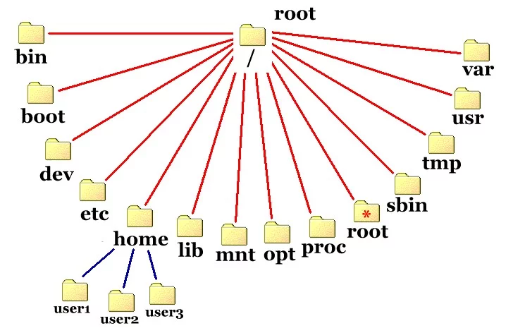

# Estrutura de diretórios

### `/` 

* Também chamado de **diretório raiz** ou **root**

* É o diretório no topo da hierarquia de pastas no Linux

* Os nomes de cada diretório são separados por `/` (no Linux)

  * **OBS**: esse separador pode varia de acordo com o sistema operacional

* `~`: representa o diretório `/home`, ou seja, a pasta pessoal do usuário

### `/home`

* Armazena todos os diretórios de usuários do sistema