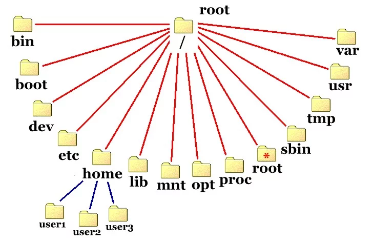

# Padrão de hierarquia de sistema de arquivos

A estrutura de diretório no sistema operacional Linux segue uma hierarquia padrão que organiza os arquivos e diretórios de forma lógica e consistente. Essa estrutura é conhecida como "Filesystem Hierarchy Standard" (FHS), e ela ajuda a manter uma organização clara e previsível dos arquivos do sistema. Aqui estão os principais diretórios e suas finalidades na hierarquia do Linux:

1. **/bin:** Contém executáveis básicos do sistema que são necessários para o funcionamento, mesmo quando outros sistemas de arquivos não estão montados.

2. **/boot:** Contém os arquivos necessários para a inicialização do sistema, como o bootloader (GRUB) e os kernels do Linux.

3. **/dev:** Contém os arquivos de dispositivos, que representam e fornecem acesso a dispositivos de hardware e interfaces do sistema.

4. **/etc:** Contém os arquivos de configuração do sistema e de aplicativos. É aqui que você encontrará configurações do sistema, arquivos de rede, configurações de serviços, entre outros.

5. **/home:** É o diretório base para os diretórios pessoais dos usuários. Cada usuário terá um subdiretório aqui, onde eles podem armazenar seus próprios arquivos e configurações.

6. **/lib:** Contém bibliotecas compartilhadas que são essenciais para os executáveis do sistema e aplicativos.

7. **/media:** É o local onde dispositivos de mídia removíveis, como USB e CD/DVD, são automaticamente montados quando inseridos no sistema.

8. **/mnt:** É um ponto de montagem temporário para sistemas de arquivos adicionais, como sistemas de arquivos de rede (NFS) ou partições montadas manualmente.

9. **/opt:** É usado para instalar aplicativos opcionais, que não são fornecidos pelo sistema, mas são adicionados posteriormente.

10. **/proc:** Contém informações sobre processos e o sistema em tempo de execução, apresentadas como arquivos virtuais.

11. **/root:** É o diretório pessoal do usuário root (superusuário). Não é o mesmo que o diretório inicial do usuário "root".

12. **/sbin:** Contém executáveis do sistema que são usados para fins administrativos e manutenção do sistema.

13. **/srv:** Contém dados específicos do site que são servidos pelo sistema. Geralmente, é usado para armazenar dados de serviços da web.

14. **/tmp:** É um diretório temporário onde os programas podem criar arquivos temporários durante a execução.

15. **/usr:** Contém a maioria dos programas e arquivos para usuários, incluindo bibliotecas, documentação e binários de sistema não essenciais.

16. **/var:** Contém dados variáveis que mudam durante a execução do sistema, como arquivos de log, spools de impressão e dados de cache.

Essa é apenas uma visão geral dos principais diretórios na estrutura de diretório do Linux. Cada diretório tem uma finalidade específica para manter uma organização coerente e facilitar a administração e o uso do sistema operacional.
