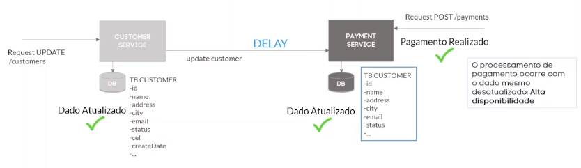
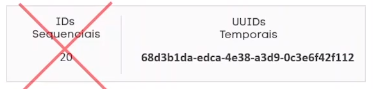
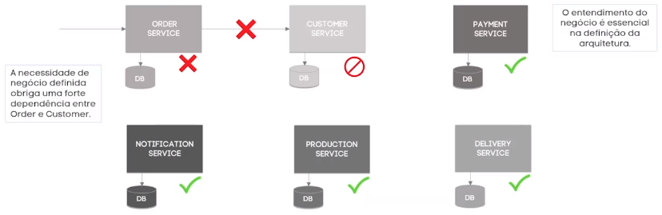
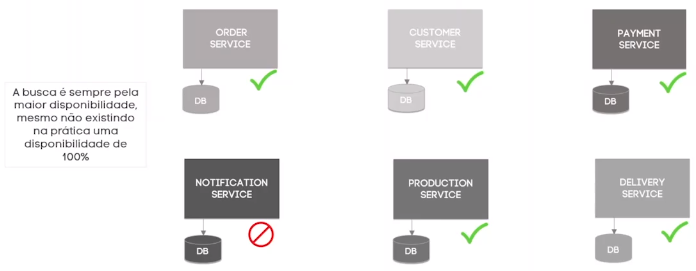
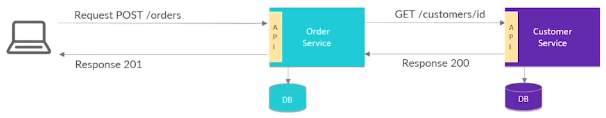
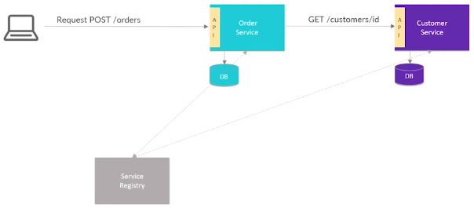

# Conceitos e dinâmica de funcionamento da Arquitetura de Microsserviços

> ## **Dinâmica de funcionamento**

### **Representação**

### **Fundamentos**

Envolve desde conceitos técnicos, financeiras e gerenciais moldados principalmente sobre a necessidade do negócio.

A mudança de paradigma para microsserviços requer também uma mudança equivalente na estrutura da organização. Não só uma questão técnica, é também cultural e organizacional.

É um subconjunto dos conceitos de sistemas distribuídos modernos.

> ## **Conceitos**

### **Sincronia de dados em sistemas distribuídos**

Não há como garantir alta disponibilidade com consistência forte ao mesmo tempo em uma arquitetura de microsserviços com dados distribuídos.

**Consistência de dados** é a capacidade de garantir a integridade dos dados, sem divergência e nem ambiguidade de dados dentro da aplicação:

  

### **Disponibilidade VS Consistência forte**

> Baseado no **teorema CAP**.

Para garantir a alta disponibilidade em sistemas distribuídos com dados compartilhados é necessário a sincronia de dados de forma assíncrona e não bloqueante, gerando uma **inconsistência eventual**.

  > **Inconsistência eventual**: os dados podem estar momentaneamente desatualizados ou não replicados ao serem consultados

### **UUIDs**

Os `UUIDs` são um meio de criar dados com identificadores únicos afim de evitar conflitos/ambiguidades entre eles.

São identificadores temporais universalmente exclusivos e essenciais para a sincronia de dados distribuídos.

**Vantagens dos UUIDs**:

* Geração simples

* Fácil replicação de dados

* Garantia de uma maior manutenibilidade

* Únicos em qualquer base de dados

**OBS**: no contexto de microsserviços, identificados sequenciais não é considerado uma boa abordagem:

### **Acoplamento**

**Não** existe desacoplamento absoluto entre os microsserviços, entretanto é possível ter um **baixo acoplamento**.

### **Disponibilidade**

Não existe 100% de disponibilidade, pois sempre existe alguma dependência entre os serviços da aplicação.

### **Distribuição das bases de dados**

É possível ter compartilhamento de bancos de dado entre serviços.

É comum essa prática no início do processo de migração de monolito para microsserviço.

> ## **Padrões de microsserviços**

> É fundamental durante a elaboração de uma aplicação de microsserviços.

### **Database per Service Pattern**

Esse padrão consiste ter 1 banco de dados por serviço

**Vantagens**:

* Baixo acoplamento 

**Desvantagens**:

* É necessário saber lidar corretamente com os **dados distribuídos** (sincronização de dados e com a consistência eventual)

* Dados distribuídos requerem uma comunicação entre microsserviços

### **Shared Database Pattern**

Compartilhamento de banco de dados entre serviços.

Muito comum na migração de um aplicações monolíticas para microsserviços.

### Communication Patterns

* **Comunicação síncrona (*synchronous communication*)**

  * **Request <-> Response**

  * Geralmente feita via *REST API*

    

    > Comunicação utilizando o protocolo HTTP/HTTPS.

* **Asynchronous communication (comunicação assíncrona)**

### **Services Registry e Service Discovery**

Monitoramento dos endereços/instâncias de cada serviço registrado nele, afim de fornecer essas informações para os serviços que necessitam disso. Além disso, o *Service Registry* faz o balanceamento de carga entre as instâncias de cada serviço, com o objetivo de buscar instância do serviço mais adequado para processar essa requisição.

**OBS**: esse padrão é uma "preocupação transversal" na arquitetura de microsserviços.

  > **Preocupação transversal**: são pontos envolvendo vários serviços dentro da arquitetura. Exemplos: Service Registry, configurações externas e segurança

### **Circuit Beaker**

Prevenir falhas em cascatas na arquitetura.

  > **Falhas em cascatas**: caso um serviço esteja fora do ar (sem o uso de *circuit beaker*) as próximas requisições falharão e o mecanismo de retentativa reenviará essas requisições, dessa forma, sobrecarregando o servidor.

Possui a responsabilidade de garantir a resiliência e uma tratativa eficiente.

Também atua na política de retentativa, mais para isso é necessário implementar o método de `fallback` (no caso do Spring).

**Os 3 estados no *circuit breaker***:

* **Fechado**: quando o *circuit breaker* nota um serviço fora do ar (serviço com falhas)

* **Meio aberto**: quando o *circuit breaker* nota uma possível retomada/recuperação do serviço.Nesse cenário, o *circuit breaker* envia algumas "requisições testes" para verificar o status de funcionamento desse serviço.

* **Aberto**: quando o *circuit breaker* nota um serviço no ar

### **API Gateway Pattern**

Centraliza as entradas externas, afim de evitar a exposição desnecessário de serviços.

Realiza os roteamentos (redirecionamento) e filtros.

É responsável pelo balanceamento de carga, por estar conectado com o *Service Registry*.

  > **OBS**: a *API Gateway* é um cliente do *Service Registry* por estar registrado nele