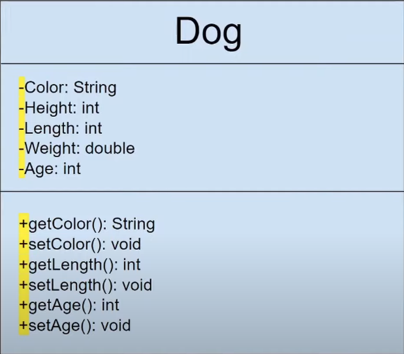
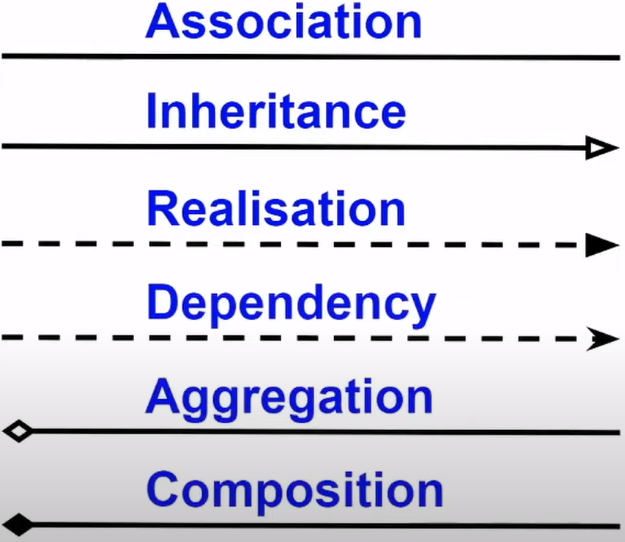
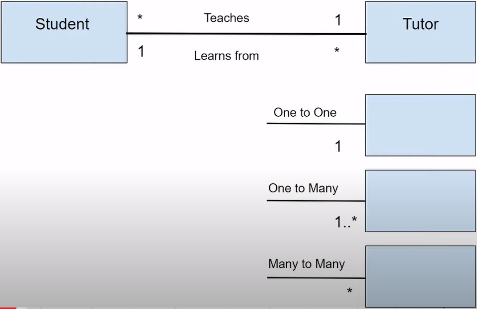
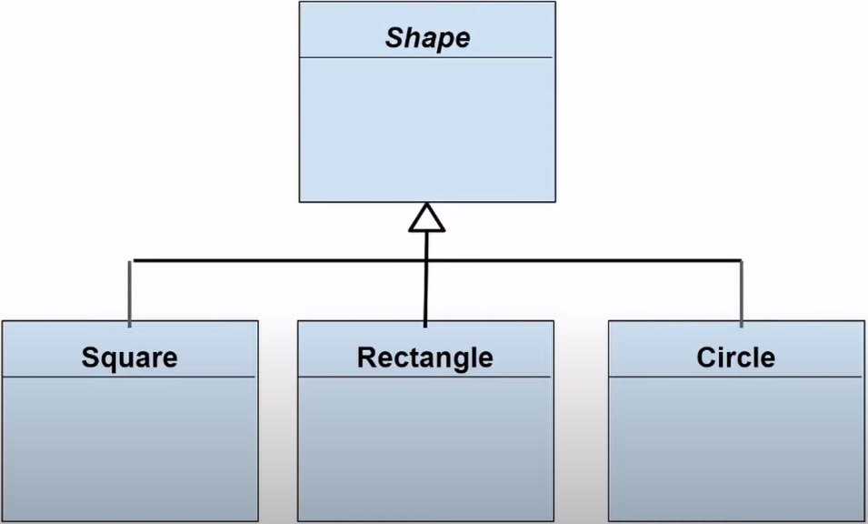
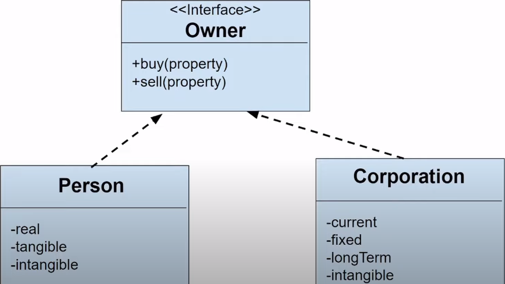
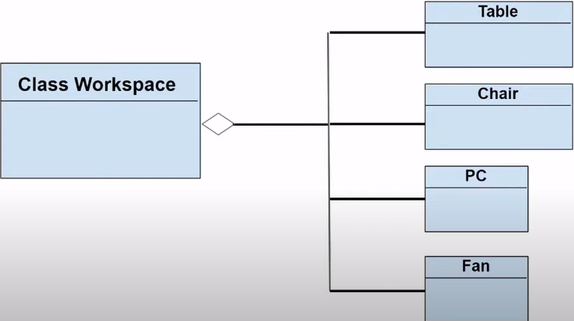
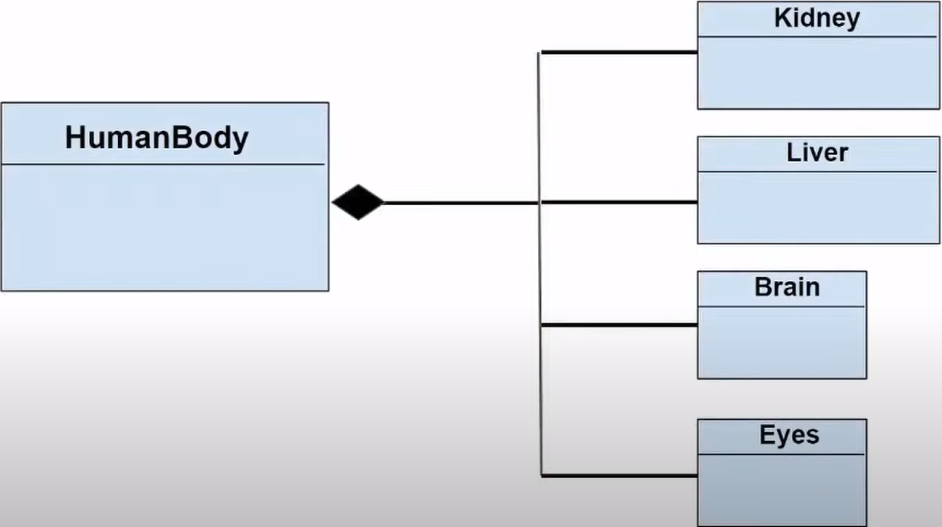

# Diagrama de classes 

### Estrutura

> Nome da classe

> Atributos

> Métodos

### Modificadores de acesso

* `-` = privado

* `+` = público

* `#` = protected

* `~` = *default* (visível apenas para o pacote da classe)

### Associação entre classes

* **Associação**

  

* **Generalização ou Herança**: relação entre classes concretas e abstratas

  > **OBS**: classes abstratas são escritas em *itálico*

  

* **Refinamento**: relação entre classes e interfaces

  

* **Dependência**

  

* **Agregação**

  

* **Composição**: tipo de agregação

  